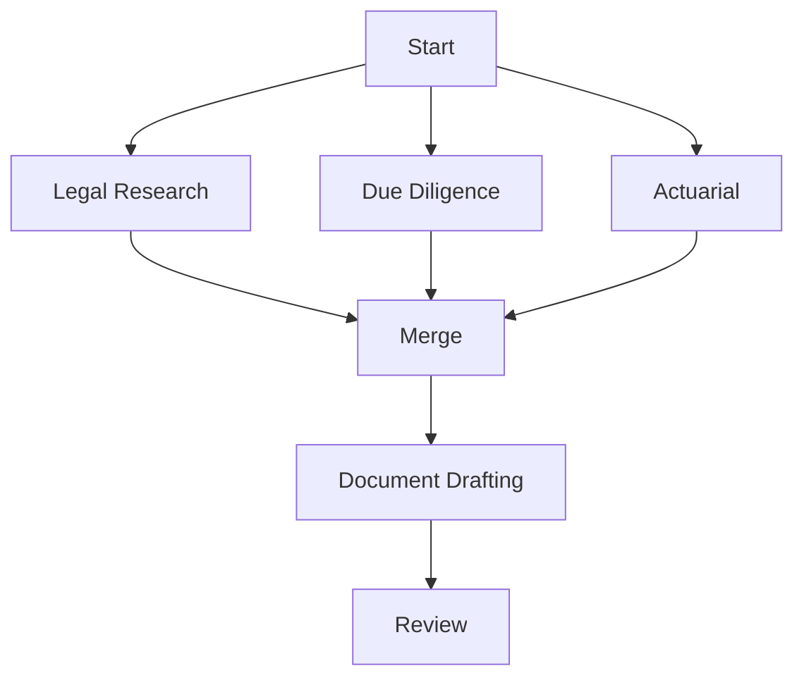

# AI Agent Orchestration

The HEIR Legal Swarm uses specialized AI agents to handle complex estate planning workflows.

## Agent Types

### 🏛️ Legal Research Agent
Analyzes jurisdiction laws, precedents, and regulatory requirements across 255+ jurisdictions.

**Capabilities:**
- Legal framework analysis
- Precedent research
- Compliance checking
- Regulatory interpretation
- Cross-jurisdiction comparison

**MCP Tools:**
```json
{
  "agent": "legal-research",
  "task": "analyze-jurisdiction",
  "input": {
    "jurisdiction": "california",
    "aspects": ["inheritance-laws", "tax-laws", "probate-process"]
  }
}
```

### 📝 Document Drafting Agent
Generates jurisdiction-compliant legal documents, wills, trusts, and contracts.

**Capabilities:**
- Will generation
- Trust creation
- Power of attorney drafting
- Healthcare directives
- Business succession plans

**MCP Tools:**
```json
{
  "agent": "document-drafting",
  "task": "generate-will",
  "input": {
    "jurisdiction": "new-york",
    "template": "comprehensive-will",
    "beneficiaries": [...],
    "assets": [...]
  }
}
```

### ⛓️ Smart Contract Agent
Creates, audits, and deploys smart contracts across multiple blockchain platforms.

**Capabilities:**
- Multi-chain contract generation (Ethereum, Solana, TON, Base, etc.)
- Security auditing
- Gas optimization
- Cross-chain bridges
- Contract upgrades

**MCP Tools:**
```json
{
  "agent": "smart-contract",
  "task": "generate-contract",
  "input": {
    "blockchain": "evm",
    "network": "ethereum",
    "contractType": "inheritance-vault",
    "features": ["multi-sig", "time-lock", "dead-mans-switch"]
  }
}
```

### 🔍 Due Diligence Agent
Performs comprehensive asset discovery, valuation, and risk assessment.

**Capabilities:**
- Asset discovery
- Valuation analysis
- Risk profiling
- Fraud detection
- Compliance verification

**MCP Tools:**
```json
{
  "agent": "due-diligence",
  "task": "asset-discovery",
  "input": {
    "walletAddresses": [...],
    "bankConnections": [...],
    "realEstateRecords": true
  }
}
```

### 📊 Actuarial Agent
Provides AI-powered life expectancy modeling and financial projections.

**Capabilities:**
- Life expectancy calculations
- Financial modeling
- Risk assessment
- Insurance analysis
- Tax optimization

**MCP Tools:**
```json
{
  "agent": "actuarial",
  "task": "life-expectancy",
  "input": {
    "age": 65,
    "gender": "male",
    "healthFactors": {...},
    "lifestyle": {...}
  }
}
```

### ✅ Review Agent
Final compliance review and quality assurance for all generated documents.

**Capabilities:**
- Document validation
- Compliance checking
- Error detection
- Consistency verification
- Best practice enforcement

**MCP Tools:**
```json
{
  "agent": "review",
  "task": "validate-documents",
  "input": {
    "documents": [...],
    "jurisdiction": "california",
    "complianceLevel": "strict"
  }
}
```

### 💼 Tax Optimization Agent
Analyzes and optimizes estate tax strategies across jurisdictions.

**Capabilities:**
- Tax liability calculation
- Optimization strategies
- Gift tax planning
- Generation-skipping transfer tax
- International tax treaties

### 🌍 International Estate Agent
Handles cross-border estate planning complexities.

**Capabilities:**
- Multi-jurisdiction coordination
- Treaty analysis
- Foreign asset management
- Expatriate planning
- Dual citizenship considerations

### 🏦 Financial Planning Agent
Integrates estate planning with comprehensive financial strategies.

**Capabilities:**
- Retirement planning integration
- Investment strategy alignment
- Insurance coordination
- Charitable giving optimization
- Business succession planning

### 👨‍👩‍👧‍👦 Family Dynamics Agent
Manages complex family situations and special circumstances.

**Capabilities:**
- Blended family planning
- Special needs trusts
- Minor beneficiary protection
- Divorce considerations
- Family business transitions

## Workflow Orchestration

### Sequential Workflow
Agents work in sequence, each building on the previous agent's output:


**Example MCP Call:**
```json
{
  "workflow": "sequential",
  "agents": [
    {"type": "legal-research", "task": "analyze-jurisdiction"},
    {"type": "due-diligence", "task": "asset-discovery"},
    {"type": "actuarial", "task": "risk-assessment"},
    {"type": "document-drafting", "task": "generate-will"},
    {"type": "smart-contract", "task": "generate-contract"},
    {"type": "review", "task": "final-validation"}
  ]
}
```

### Parallel Workflow
Multiple agents work simultaneously on different aspects:



**Example MCP Call:**
```json
{
  "workflow": "parallel",
  "stages": [
    {
      "parallel": true,
      "agents": [
        {"type": "legal-research", "task": "analyze-jurisdiction"},
        {"type": "due-diligence", "task": "asset-discovery"},
        {"type": "actuarial", "task": "life-expectancy"}
      ]
    },
    {
      "parallel": false,
      "agents": [
        {"type": "document-drafting", "task": "generate-documents"},
        {"type": "review", "task": "validate"}
      ]
    }
  ]
}
```

### Conditional Workflow
Agents are activated based on specific conditions:

```json
{
  "workflow": "conditional",
  "rules": [
    {
      "condition": "estate_value > 11000000",
      "agents": ["tax-optimization", "international-estate"]
    },
    {
      "condition": "has_minor_children",
      "agents": ["family-dynamics", "trust-specialist"]
    },
    {
      "condition": "owns_business",
      "agents": ["business-succession", "valuation-expert"]
    }
  ]
}
```

## Agent Communication

### Message Passing
Agents communicate through a standardized message format:

```json
{
  "from": "legal-research",
  "to": "document-drafting",
  "timestamp": "2024-01-22T10:00:00Z",
  "data": {
    "jurisdiction_analysis": {...},
    "required_clauses": [...],
    "compliance_notes": [...]
  },
  "priority": "high"
}
```

### Shared Context
All agents have access to a shared context object:

```json
{
  "session_id": "estate_plan_12345",
  "client": {
    "id": "client_789",
    "jurisdiction": "california",
    "assets": [...],
    "beneficiaries": [...]
  },
  "agents_completed": ["legal-research", "due-diligence"],
  "agents_pending": ["document-drafting", "smart-contract"],
  "artifacts": {
    "jurisdiction_report": "artifact_001",
    "asset_inventory": "artifact_002"
  }
}
```

## Error Handling

### Agent Failures
When an agent fails, the system implements automatic recovery:

```json
{
  "error": {
    "agent": "smart-contract",
    "task": "generate-contract",
    "code": "GAS_ESTIMATION_FAILED",
    "message": "Unable to estimate gas on Ethereum mainnet"
  },
  "recovery": {
    "strategy": "fallback",
    "action": "switch-to-polygon",
    "retry_count": 1
  }
}
```

### Conflict Resolution
When agents produce conflicting recommendations:

```json
{
  "conflict": {
    "agents": ["legal-research", "tax-optimization"],
    "issue": "beneficiary_distribution",
    "recommendations": {
      "legal-research": "equal_distribution",
      "tax-optimization": "staged_distribution"
    }
  },
  "resolution": {
    "strategy": "human-in-loop",
    "prompt": "Legal compliance suggests equal distribution, while tax optimization recommends staged distribution. Please choose your preference."
  }
}
```

## Performance Metrics

### Agent Performance
Track individual agent performance:

```json
{
  "agent": "document-drafting",
  "metrics": {
    "average_completion_time": "45s",
    "success_rate": 0.98,
    "error_rate": 0.02,
    "documents_generated": 1523,
    "user_satisfaction": 4.8
  }
}
```

### Workflow Analytics
Monitor complete workflow execution:

```json
{
  "workflow_id": "estate_plan_12345",
  "total_time": "5m 32s",
  "agents_used": 6,
  "tokens_consumed": 45000,
  "cost": "$2.35",
  "outcome": "success"
}
```

## Best Practices

### 1. Agent Selection
Choose agents based on complexity:
- **Simple Will**: Legal Research → Document Drafting → Review
- **Complex Estate**: All agents in orchestrated workflow
- **International**: Add International Estate and Tax Optimization

### 2. Resource Optimization
- Use parallel processing when agents don't depend on each other
- Cache agent outputs for reuse
- Implement timeout limits for long-running tasks

### 3. Quality Assurance
- Always include Review Agent as final step
- Implement human-in-loop for high-value estates
- Maintain audit trails of all agent decisions

### 4. Security
- Encrypt all inter-agent communications
- Implement agent authentication
- Log all agent actions for compliance

## Integration Examples

### Cursor IDE Integration
```javascript
// In Cursor, agents are automatically available
const result = await heir.orchestrate({
  workflow: "estate-planning",
  agents: ["legal-research", "document-drafting", "smart-contract"],
  context: {
    jurisdiction: "california",
    estate_value: 5000000
  }
});
```

### Claude Desktop Integration
```python
# Claude can orchestrate agents through natural language
"Create a comprehensive estate plan for a California resident with 
$5M in assets, including crypto holdings and international property"

# Claude automatically:
# 1. Activates Legal Research Agent for CA laws
# 2. Runs Due Diligence for asset verification  
# 3. Uses International Estate Agent for foreign property
# 4. Generates documents with Document Drafting Agent
# 5. Creates smart contracts with Smart Contract Agent
# 6. Validates everything with Review Agent
```

### API Integration
```bash
curl -X POST https://api.heir.es/agents/orchestrate \
  -H "Authorization: Bearer YOUR_API_KEY" \
  -H "Content-Type: application/json" \
  -d '{
    "workflow": "comprehensive-estate-plan",
    "agents": ["all"],
    "context": {
      "jurisdiction": "new-york",
      "estate_value": 15000000,
      "beneficiaries": 3,
      "include_crypto": true
    }
  }'
```

## Coming Soon

### Future Agents
- **Charity Planning Agent**: Optimize charitable giving strategies
- **Pet Trust Agent**: Specialized planning for pet care
- **Digital Legacy Agent**: Manage digital assets and online accounts
- **Healthcare Directive Agent**: Advanced medical directives
- **Guardianship Agent**: Minor children guardian selection

### Enhanced Capabilities
- Real-time collaboration between agents
- Machine learning from past workflows
- Predictive agent selection
- Natural language agent programming
- Visual workflow designer